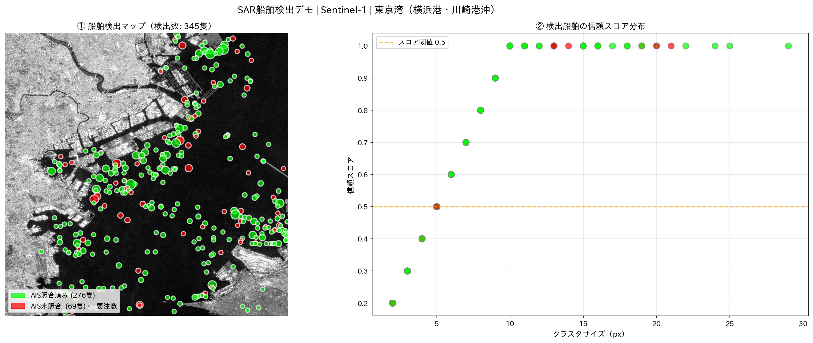

# 🛳️ SAR衛星データによる港湾・船舶動態モニタリングポートフォリオ

> **このリポジトリについて**
> QPS研究所の国内セールス職への応募にあたり、作成した学習・探索目的のポートフォリオです。
> 衛星データ解析は現在学習中であり、技術的な完成度よりも**「どの顧客のどの課題をQPS-SARで解決できるか」という提案の思考プロセス**を見ていただければ幸いです。
> コードの実装にはAIツールを活用しています。処理の意図と提案ロジックは自分の言葉で説明できます。

---

## 📌 なぜこのユースケースを選んだか

QPS研究所について調べる中で、「**船舶・車両等の動きを観測した安全保障や交通サービスへの寄与**」が活用領域として挙げられていることに気づきました。

日本は四方を海に囲まれた海運大国であり、港湾は物流・安全保障・経済活動の要です。しかし港湾管理の現場では、**AIS（自動船舶識別装置）を搭載していない船や、意図的にAISをオフにした船の動態を把握する手段がない**という課題があります。光学衛星は悪天候・夜間に使えず、航空機での常時監視はコストが見合わない。

SARはこの課題を解決できる数少ない技術です。さらにQPS-SARの1m分解能・10分間隔観測は、小型船舶の識別精度や検知速度の面で既存SARを大きく上回ると理解しています。

このポートフォリオを作った目的は2つです。

1. **自分がQPS-SARの価値をどう理解しているかを示すこと**
2. **顧客課題から提案を組み立てる思考プロセスを見せること**

技術の深い理解はこれから身につけていきます。まず「なぜこのユースケースなのか」という営業の起点となる仮説を、自分の頭で考えたことを示したいと思っています。

---

## 📂 リポジトリ構成

```
.
├── README.md                          ← このファイル（提案の思考プロセス）
├── proposal.md                        ← 港湾管理者・海運企業向け仮想営業提案資料
├── ship_detection_gee.ipynb           ← Google Earth EngineでSAR船舶検出を試みるNotebook
├── customer_industry_understanding.md ← 顧客業界理解メモ（防災・港湾）
├── why_i_am_needed.md                 ← なぜ私がQPSに必要かを述べた自己PR
├── images/
│   └── ship_detection_result.png     ← 実データによる解析結果
└── requirements.txt                   ← 必要パッケージ一覧
```

---

## 🚀 クイックスタート

### Google Colabで実行（推奨）

1. [Google Colab](https://colab.research.google.com) を開く
2. `ship_detection_gee.ipynb` をアップロード
3. セルを上から順番に実行
4. 初回のみGoogleアカウントでGEE認証が必要です

### GEEプロジェクトの準備

1. [GEE公式サイト](https://earthengine.google.com) で無料アカウントを作成
2. Google Cloud Console でプロジェクトを作成
3. Earth Engine API を有効化
4. Notebookの `project='your-project-id'` を自分のプロジェクトIDに書き換える

---

## 🔬 使用技術

| カテゴリ               | 使用技術                                              |
| ---------------------- | ----------------------------------------------------- |
| 衛星データ取得・処理   | Google Earth Engine（Python API）                     |
| インタラクティブ可視化 | `geemap`                                            |
| 船舶検出               | CA-CFARアルゴリズム + 海面マスク                      |
| 数値処理・可視化       | `numpy`, `matplotlib`, `scipy`                  |
| 日本語フォント         | `japanize-matplotlib`                               |
| 実行環境               | Google Colab（推奨）                                  |
| データ                 | Sentinel-1 GRD（ESA Copernicus・GEE公開データ・無料） |

---

## 📊 解析の考え方

SARで船舶を検出できる理由を自分なりに理解した上でコードを構成しています。

```
海面の特性：
  穏やかな海面は電波を鏡面反射するため、SAR画像上で暗く映る

船舶の特性：
  金属構造が電波を強く反射するため、海面背景の中で明るい輝点として映る

検出の仕組み：
  海面の明るさのばらつきを統計的に推定し、
  それより有意に明るいまとまりを船舶候補として抽出する（CFAR法）

海面マスクの適用：
  陸地の誤検出を除去するため、SAR輝度が低いエリア（海面）のみに
  検出範囲を絞り込んでいる（閾値：-17dB）
```

アルゴリズムの細部は学習中ですが、「なぜ海面と船舶が区別できるのか」という原理は理解した上で実装しています。

---

## 🗺️ 解析結果サンプル



> **東京湾（横浜港・川崎港沖）| Sentinel-1 メディアン合成（27シーン）**
> CA-CFARアルゴリズムによる船舶自動検出。345隻を検出。
> 緑：AIS照合済み（276隻）/ 赤：AIS未照合（69隻・要注意）
> ※ AIS照合はシミュレーションです。実運用にはAISデータとの連携が必要です。

---

## 🛰️ QPSがSentinel-1より優れると考える理由

| 比較軸 | Sentinel-1（本解析） | QPS-SAR（現在：9機運用中） | QPS-SAR（将来：36機体制目標） |
|--------|---------------------|--------------------------|------------------------------|
| 分解能 | 5〜20m | **46cm〜1m** | **46cm〜1m** |
| 観測頻度 | 数日〜1週間 | 段階的に向上中 | **10〜40分間隔を目指す** |
| 小型船の識別 | 難しい | より詳細な把握が期待される | **可能** |
| 船種識別 | 不可 | 可能性あり | **可能** |

> ※ QPSホールディングスの2026年5月期第3Q決算資料より。  
> 現在9機が商用運用中。2031年5月期に36機体制を目指しており、機数増加とともに観測頻度も段階的に向上する計画です。

Sentinel-1でも大型船は検出できますが、小型漁船や工作船の識別には分解能が足りません。QPS-SAR（46cm〜1m）になることで「船体の輪郭・向きまで識別できる」ようになる可能性があり、港湾保安のユースケースで大きな差が生まれると考えています。

---

## 📄 営業提案資料

顧客課題の整理・ターゲット別提案シナリオ・導入ロードマップは [`proposal.md`](./proposal.md) をご覧ください。
顧客業界の理解メモは [`customer_industry_understanding.md`](./customer_industry_understanding.md) をご覧ください。

---

## ⚠️ 注意事項

- 本リポジトリはポートフォリオ目的の個人の学習・探索成果物です
- コードの実装にはAIツールを活用しています
- GEEの認証情報はこのリポジトリには含まれていません

---

## 🔗 関連リポジトリ

- **[Repo A: Sentinel-1 × 災害リスク可視化](https://github.com/Mitsuaki-1004/sar-flood-detection-portfolio)**
  Google Earth Engineを使った浸水域自動検出の試み（国交省・自治体向け提案）

---

*作成者：森山　光明 | [GitHub](https://github.com/Mitsuaki-1004)*
